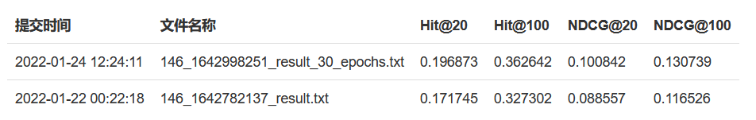
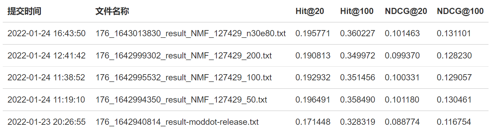

# Web信息处理与应用 Exp3 实验报告

USTChorusWeb2021
PB19000001 江小白
PB19051055 彭浩然

## 目录

[TOC]

## 关键提交记录

本次实验有以下几次具有代表性的提交，其中最佳结果为第一行的提交。

| 提交编号       | 相关算法    | Hit@20   | Hit@100  | NDCG@20  | NDCG@100 |
| -------------- | ----------- | -------- | -------- | -------- | -------- |
| 146_1642998251 | NMF-n100e30 | 0.196873 | 0.362642 | 0.100842 | 0.130739 |
| 176_1642940814 | kNN-moddot  | 0.171448 | 0.328319 | 0.088774 | 0.116754 |

所有提交的截图如下。有一些实验性的算法仅仅在本地进行测试，没有提交，将在下文中说明。





## 使用的技术

本次实验中，我们借助C++平台下的Eigen[^1]线性代数库完成了大多数运算任务，包括稀疏矩阵表示、矩阵乘法、矩阵内积、矩阵逐元素乘除法等。考虑到本次实验的用户和物品数目较多，存储完整的评分矩阵十分消耗资源，我们在很多情况下都使用了稀疏矩阵表示。

与C++语言本身的哲学相同，Eigen非常注重运算效率，并且通过各种方式对常用组件进行了优化，其中对长表达式求值顺序的自动优化使我们可以将公式直接转化为可读性更好的代码，而基于openmp的并发优化允许我们最大程度地利用CPU资源完成计算任务。

除了Eigen本身的并发优化外，在程序的一些可以显式并发优化的场景下，我们也直接使用了openmp[^2]的并发原语以及C++11引入的线程库进行并发优化，例如同时计算多个物品的相似度、同时对多个用户进行预测等。

使用C++进行编写的代码，均使用如下命令编译：

```
g++ -O3 -lpthread -fopenmp -std=c++17 src.cpp -o src
```

在对SVD算法进行初步测试时，我们曾使用Python平台下的Surprise[^3]库中的SVD模块。但由于性能和效果不佳，我们后来用Eigen对其进行了重写。Surprise库并没有出现在我们最终提交的运行结果中。

各种算法的设计思路以及迭代公式，均参考课程PPT。


## 数据集划分与本地测试

### 数据集划分

为了尽可能地节约提交次数、在正式提交前对算法的效果有一个较准确的评估，我们将原始数据集中每个用户的最后一个物品作为本地测试集 `valid_dataset.txt` ，其余划分为训练集 `train.txt` 。

### 本地测试

在本地测试程序 `local_test.cpp` 中，输入文件与提交至测试平台的文件相同。我们采用了与TAs提供的测试平台中相同的评价指标，即
$$
HR@K=\frac{1}{|U|}\sum_uI(|R_u\cap T_u|)\\
NDCG@K=\frac{1}{u}\sum_u\sum_{k=1}^{K}\frac{2^{I(|\{r_u^k\}\cap T_u|)}-1}{\log_2(k+1)}
$$
注意到我们的测试集中每个用户仅对应一个物品，所以 NDCG@K 的分子部分实际上可以直接取为1.

## 基于物品的kNN推荐

### 基于评分的算法

我们直接采用了老师上课时已经详细讨论过的基于物品的k-近邻算法，作为最原始的模型。此部分在源码中对应的文件为 `model_kNN/kNN_itemBased.cpp` 。该部分的一些公式参考了surprise库的官方文档[^4]。

由于是基于评分的算法，我们在计算相似度时直接忽略了只交互、未评分的数据（这种做法等价于将评分取为当前物品的平均得分——因为在计算Pearson相似度时会减去均值）。

#### 计算物品的相似度

我们采用最朴素的Pearson相似度进行计算：
$$
\mathrm{pearson\_sim}(i, j) = \frac{ \sum\limits_{u \in U_{ij}}
(r_{ui} -  \mu_i) \cdot (r_{uj} - \mu_{j})} {\sqrt{\sum\limits_{u
\in U_{ij}} (r_{ui} -  \mu_i)^2} \cdot \sqrt{\sum\limits_{u \in
U_{ij}} (r_{uj} -  \mu_{j})^2} }
$$
具体实现：分子部分容易通过向量内积操作实现，但是分母部分，每个向量的模只取了两个物品对应的用户交集部分进行L2范数的计算。因此，我们通过新定义一个二元运算符，仅仅保留左侧的列向量中那些`i, j`两个用户均交互过的矩阵元，否则置为0。

```c++
auto filterLhs(const SparseMatrix<double> &lhs, const SparseMatrix<double> &rhs)
{
    struct DoubleAndReserveLhs
    {
        double operator()(double lhs, double rhs) const
        {
            if (lhs && rhs) return lhs;	
            return 0.0;
        };
    };
    return CwiseBinaryOp<DoubleAndReserveLhs, const SparseMatrix<double>, const SparseMatrix<double>>(lhs.derived(), rhs.derived());
}
```

这样，我们可以方便地通过

```c++
double norm1 = filterLhs(ratings.col(j), ratings.col(l)).norm();
double norm2 = filterLhs(ratings.col(l), ratings.col(j)).norm();
if (norm1 == 0.0) continue;
double sim = ratings.col(j).dot(ratings.col(l)) / (norm1 * norm2);
if (sim == 1 || sim == -1) continue;
similarity[j][l] = similarity[l][j] = sim;
```

来进行内积。注意到上述算法中过滤掉了那些 `sim == 1 || sim == -1` 的元素，这是因为考虑对于特定的某两个物品，可能同时交互过两个物品的用户数量只有1个（尤其是其中一个物品更冷门的情况下），这时，计算出的相似度高达1，但并没有参考价值。因此我们选择直接过滤掉。

#### 根据k-近邻预测评分

采用的公式为：
$$
\hat{r}_{ui} = \mu_i + \frac{ \sum\limits_{j \in N^k_u(i)}
\text{sim}(i, j) \cdot (r_{uj} - \mu_j)} {\sum\limits_{j \in
N^k_u(i)} \text{sim}(i, j)}\
$$
其中参数的含义如下：

- k：最近邻的数量
- $\mu_i$：第i个物品的平均得分

对每个用户，我们选取预测得分前100的物品作为给出的结果。

#### 本地测试结果

该算法的本地测试结果并不算理想，因此并没有上传至测试平台。这里我们列出一个具有代表性的结果：

| Hit@20      | Hit@100    | NDCG@20     | NDCG@100    |
| ----------- | ---------- | ----------- | ----------- |
| 0.000423747 | 0.00233061 | 0.000173092 | 0.000511995 |

预测结果甚至不及随机猜测（约为0.005）。

### 忽略评分的算法

此部分在源码中对应的文件为 `model_kNN_modified/kNN_moddot.cpp` 和 `model_kNN_modified/kNN_moddot_int_openmp.cpp` 。

考虑到TAs给出的评价指标主要关注“是否交互”而并非具体的评分，我们在上述算法的基础上，尝试了一种更简单但是更有效的算法：忽略物品的评分，将所有交互过、评分过的物品在评分矩阵中记为1。

对于只交互过但未评分的物品，我们也提出了两种不同的处理方法：

- 简单地视作1
- 在评分矩阵中记为 `NO_RATING_PLACEHOLDER` ，该值可以视为一个超参数，默认值为0.5

#### 相似度算法的修改

既然我们将交互过、有评分的物品在评分矩阵中记为1，那么在极端情况下（即所有交互过当前物品的用户都给当前物品打了分），去中心化之后该物品对应的列向量将变成非零元，此时，去中心、计算Pearson相似度的做法就不再可取了。

一种简单且合理的思路是，用同时交互过`i, j` 两个物品的用户数量作为二者的相似度。关于只交互、未评分的物品，我们也有两种对应的思路：

- 思路1：简单地用两个物品对应的列向量的内积作为相似度，即
  $$
  \mathrm{sim}(i, j) = \sum\limits_{u \in U_{ij}}
  r'_{ui} \cdot r'_{uj}
  $$
  其中

  $$r'_{ui}= \left\{\begin{aligned}1&\qquad\text{u graded i }\\0.5&\qquad\text{u interacted with i but did not grade i}\end{aligned}\right.$$

- 思路2 (kNN-moddot)：我们设计了一种特殊的内积算法：遍历所有的u，对乘积项求和，乘积项定义如下

  - 当 $u$ 同时交互 **且 **评分过$i, j$ 时，对应乘积项为1
  - 当 $u$ 未交互过 $i$ **或者** 未交互过 $j$ 时，对应乘积项为0
  - 除去上面两种情况，对应乘积项为0.5

- 上面两种思路的区别仅仅体现在当 $u$ 同时交互过 $i$ 和 $j$ 但都未评分时，对应乘积是0.25（思路1）或0.5（思路2）。

- 具体实现时的优化：由于相似度对最终预测结果的影响只体现在相对大小上，为了降低算法的运行时间，我们用整数运算替换了浮点数运算（即整体乘上一个整数因子，对于思路2来说，该因子为2）。代码如下：

```c++
auto mask(const SparseMatrix<int> &lhs, const SparseMatrix<int> &rhs)
{
    struct DoubleAndReserveLhs
    {
        double operator()(int lhs, int rhs) const
        {
            if (lhs == 0 || rhs == 0) return 0;
            if (lhs == 2 && rhs == 2) return 2;
            return 1;
        };
    };
    return CwiseBinaryOp<DoubleAndReserveLhs, const SparseMatrix<int>, const SparseMatrix<int>>(lhs.derived(), rhs.derived());
}
```

#### 根据k-近邻预测评分

##### 预测公式的修改

由于不考虑评分，因此预测得分时，我们对被预测物品与该用户交互过的所有其他物品的相似度进行求和：
$$
\hat{r}_{ui} =\sum_{j\in I_u}\text{sim}(i,j)
$$

##### k值的选择

相比上述简单的模型，我们也尝试了不同的k值，最后发现，由于每个用户交互过的物品并不会很多，因此 $k$ 值的存在并不会显著地影响计算量。经过数次本地测试，我们发现，如果取 $k=+\infty$ ，即考虑当前用户交互过的所有物品来进行预测，效果是最好的。

#### 本地测试结果

| k    | NO_RATING_PLACEHOLDER    | Hit@20   | Hit@100  | NDCG@20   | NDCG@100 |
| ---- | ------------------------ | -------- | -------- | --------- | -------- |
| 100  | 0.5                      | 0.17505  | 0.335565 | 0.0875399 | 0.11626  |
| 200  | 0.5                      | 0.175135 | 0.335946 | 0.0875426 | 0.116316 |
| 200  | 0.6                      | 0.175177 | 0.335989 | 0.0875735 | 0.116343 |
| inf  | 0.5                      | 0.175304 | 0.336116 | 0.0875726 | 0.116338 |
| inf  | 0.6                      | 0.175262 | 0.336158 | 0.087586  | 0.116367 |
| inf  | 1                        | 0.174711 | 0.33565  | 0.0881678 | 0.117035 |
| inf  | 0.5（moddot，对应思路2） | 0.176109 | 0.336624 | 0.0886919 | 0.117425 |

- k越大时效果越好，`k = inf` 时效果最好，即不需要考虑k-近邻数量
- 修改过内积算法（对应思路2）后效果比思路1略提高了一些
- `NO_RATING_PLACEHOLDER` 的影响并不是很大

#### 提交结果

| 提交编号       | 相关算法            | Hit@20   | Hit@100  | NDCG@20  | NDCG@100 |
| -------------- | ------------------- | -------- | -------- | -------- | -------- |
| 146_1642782137 | 思路1               | 0.171745 | 0.327302 | 0.088557 | 0.116526 |
| 176_1642940814 | 思路2（kNN-moddot） | 0.171448 | 0.328319 | 0.088774 | 0.116754 |

相比前一种kNN模型，有了较大的提升。

### 基于用户的算法

使用忽略评分的算法，已经取得了一定的效果。如果我们反思这个算法的中“物品相似度”和“推荐打分”分别有什么意义，不难发现以“共同用户数”决定的“物品相似度”，是在以用户群体的一致性表征物品的相似性，而再将这个相似度作和作为“推荐打分”，则是在试图向一个用户推荐和他/她已经访问过的物品类似的物品。

基于一种对偶的想法，我们也可以通过一个用户所交互过的物品表征其与另一个用户的相似性，再对一个用户未交互过的物品，将与其交互过的其他用户的相似性累加，来表示当前这个用户和与其交互过的用户的相似性，判断他/她是否可能由于和相似的用户有相似的偏好而可能会访问这个物品。

虽然因为忽略了评分而不同于基本的“基于用户的推荐算法”，但刚刚所介绍的算法的核心思想依然与其相同。下面几处代码是基于用户的算法与基于物品的算法的核心区别：

```c++
    SparseMatrix<int> ratings(ITEM_NUMBER, USER_NUMBER);
```

输入时将行列转置，以行代表物品，列代表用户。

```c++
                int predict_rating = 0;
                for (auto sim : most_similar_users)
                {
                    predict_rating += sim;
                }
                user_recommendation.emplace_back(predict_rating, j);
```

将用户的相似度相加，来预测物品。

这种算法容易引出另一个问题：在基于物品的相似度累加时，由于某个用户交互过的物品数量是有限的，所以新的物品所累加的相似度的次数是一样的，也就是说，对于同一个用户的预测，各种物品在相加次数上是公平的。但是在基于用户的相似度累加时，被访问次数多的物品会更多次地累加相似度，从次数上就已经给其他物品带来了不公平。基于这种想法，我们可以实现另外一个版本的基于用户的算法，即，将累加后的用户相似度归一化，以实现物品之间的公平：

```c++
                int predict_rating = 0;
                for (auto sim : most_similar_users)
                {
                    predict_rating += sim;
                }
                user_recommendation.emplace_back(double(predict_rating) / most_similar_users.size(), j);
```

这两种算法进行本地测试，分别得到如下的结果：

| 算法变种 | Hit@20    | Hit@100   | NDCG@20    | NDCG@100   |
| -------- | --------- | --------- | ---------- | ---------- |
| 未归一化 | 0.123522  | 0.249121  | 0.0607281  | 0.0830942  |
| 归一化   | 0.0124158 | 0.0295775 | 0.00561231 | 0.00868499 |

可以看到，两种算法得到的各项指标均低于基于物品的推荐。这和课堂上介绍过的启发式想法是一致的：基于用户的推荐假设用户有比较固定的偏好，而基于物品的推荐假设物品有比较固定的风格。现实中，用户的偏好可能比较多样，而物品的风格通常比较单一，因此基于物品的推荐效果会优于基于用户的推荐。

另外，归一化后的算法结果远不如未归一化的算法。我们归一化本想避免过于热门的物品获得额外的推荐评分，但最后效果却适得其反。这或许可以说明一个道理：热门的物品就应该永远热门，这个世界本来就是不公平的。

## 基于SVD分解的推荐

### 基本原理

对于矩阵分解（Matrix Factorization-based）类型的算法，我们首先想到可以尝试复现Simon Funk在Netflix Prize中提出的著名的SVD（奇异值分解）算法。奇异值分解的思想也可以应用于主成分分析（PCA），二者的区别只不过在于，推荐算法的语境下，待分解的矩阵自身不是完整的，而PCA语境下，矩阵是完整的，可以取出对角矩阵的某几个维度，达到降维的效果。定义矩阵的SVD如下：
$$
A=U\Sigma V^{T}
$$
利用结合律将 $U\Sigma$ 相乘，则原矩阵就可以写成两个矩阵相乘的格式，这正是我们期望看到的。

同样，我们侧重于交互而非评分，把所有交互过的项在评分矩阵中记为1。我们忽略 bias，因此该算法的预测公式[^5]十分简单：
$$
\hat{r}_{ui} = q_i^Tp_u
$$
残差平方和（注意，这里我们引入正则项，否则会造成拟合出的矩阵出现许多大于1的数——而这显然是不合理的）
$$
\sum_{r_{ui} \in R_{train}} \left(r_{ui} - \hat{r}_{ui} \right)^2 +
\lambda\left(||q_i||^2 + ||p_u||^2\right)
$$

为了最小化该误差，我们使用随机梯度下降算法（SGD, stochastic gradient descent）
$$
p_u \leftarrow p_u + \gamma (e_{ui} \cdot q_i - \lambda p_u)\\
q_i \leftarrow q_i + \gamma (e_{ui} \cdot p_u - \lambda q_i)\\
$$
其中 $\gamma$ 为学习率，$\lambda$ 为正则项系数。

核心代码如下：

```c++
for (int k = 0; k < EPOCHS; ++k)
{

    double total_error = 0;
    for (int iti = 0; iti < input_triplets.size(); ++iti)
    {
        auto it = input_triplets[iti];
        int u, i;
        double r;
        u = it.row();
        i = it.col();
        r = it.value();
        double inner_product = qi.row(i).dot(pu.row(u));
        double err = r - inner_product;
        total_error += err * err;
        if (uniform(e) > 0.2) continue; // SGD
        pu.row(u) += LR_ALL * (err * qi.row(i) - REG_ALL * pu.row(u));
        qi.row(i) += LR_ALL * (err * pu.row(u) - REG_ALL * qi.row(i));
        // for (int j = 0; j < N_FACTORS; ++j)
        // {
        //     pu(u, j) += LR_ALL * (err * qi(i, j) - REG_ALL * pu(u, j));
        //     qi(i, j) += LR_ALL * (err * pu(u, j) - REG_ALL * qi(i, j));
        // }
    }
    std::cout << k << " " << total_error << std::endl;
}
```

### 本地测试结果

我们仅展示数次结果中最好的一次。（具体效果受P,Q的初始化参数以及随机梯度下降时的随机性影响，并不稳定，但总体效果并不理想，因此并没有进行提交测试）

| Hit@20     | Hit@100   | NDCG@20    | NDCG@100   |
| ---------- | --------- | ---------- | ---------- |
| 0.00402559 | 0.0150854 | 0.00118275 | 0.00310348 |

### 对该算法的反思

基于SVD分解的推荐算法虽然比基于物品的kNN推荐算法更加复杂，但得到的结果却并不令人满意。通过对该算法思想的分析，我们试图从以下两个方面解释这个现象。

首先，SVD算法的假设以及目标和我们此次任务并不吻合。SVD算法的假设是每一个有效信息点都是一个评分，而它的目的是尽可能准确地补全剩下空格里的评分。基于SVD，我们会将补全的评分进行排序，并向用户推荐预测评分较高的物品。然而，此次任务的测试方式并不考虑评分，而只考虑用户是否访问这个物品，用户无论是可能打低分还是不评分都不影响任务要求它出现在预测列表里。因此，SVD算法能给出的结果是“**假如用户访问并评分了，他可能会给高分的物品**”，而任务的要求是“**用户可能会访问的物品**”，这两点之间并没有必然联系。

其次，SVD算法的梯度下降方法只考虑矩阵中的有效信息点，而不考虑0元素。如果我们忽略评分，将访问过的物品统一设成1分、其他设成0分进行SVD分解，SVD的梯度下降算法会试图使分解后的矩阵再乘回来以后原来是1的地方仍然接近1，而完全不考虑原来是0的地方。这样就导致整个梯度下降最后可能会尝试使分解后的矩阵再乘回来以后接近一个全1矩阵。这样的矩阵虽然完美符合了误差函数的需求（1仍然是1、0不用考虑），但却对预测完全没有用处。

因此，相比SVD，我们更需要一种同时会将0元素纳入误差函数和梯度下降考虑的分解方式。下面介绍的NMF分解即符合这个目标。

## 基于NMF分解的推荐

### 基本原理

NMF分解[^6]，即非负矩阵分解。其基本原理 $R\approx PQ$ 和各种矩阵分解推荐算法相似，但要求分解出来的 $P$ 和 $Q$ 两个矩阵元素均非负。其梯度下降目标为使得噪声矩阵$E=R-PQ$的二阶范数（Frobenius范数）最小化。

基于之前的经验，我们使用的$R$矩阵直接忽略评分，将一次访问记录（无论是否有评分）的位置设为1，其他位置设为0。不同于SVD的是，使用噪声矩阵的二阶范数作为误差函数会使得分解出来的矩阵考虑矩阵中的0元素，真正让“访问”和“未访问”都成为迭代过程中被利用到的信息。而最终该分解将对“是否访问”而非评分进行预测，正符合此次的任务目标。

该算法主要有两个参数：`N_FACTORS`表示 $P$ 的列数和 $Q$ 的行数，`EPOCHS`表示迭代次数。

### 迭代优化

由噪声矩阵逐元素求导得到的一个基本的迭代式是：
$$
P_{ik}=P_{ik}+\alpha_1[(R-PQ)Q^T]_{ik}\\
Q_{kj}=Q_{kj}+\alpha_2[P^T(R-PQ)]_{kj}\\
$$
为了在迭代过程中保证矩阵元素非负，可以如下取两个系数：
$$
\alpha_1=\frac{P_{ik}}{[PQQ^T]_{ik}}\\
\alpha_2=\frac{Q_{kj}}{[P^TPQ]_{kj}}\\
$$
代入，可以得到如下的迭代式：
$$
P_{ik}=P_{ik}\frac{[RQ^T]_{ik}}{[PQQ^T]_{ik}}\\
Q_{kj}=Q_{kj}\frac{[P^TR]_{kj}}{[P^TPQ]_{kj}}\\
$$
这样的迭代是逐元素的，换句话说，每个元素的迭代都需要进行完整的$PQ$矩阵乘法，显然效率不高。通过对同一行或同一列操作的合并，我们可以消去$k$，得到下面的迭代式：
$$
P_{row(i)}=P_{row(i)}*{R_{row(i)}Q^T}/{[PQ]_{row(i)}Q^T}\\
Q_{col(j)}=Q_{col(j)}*{P^TR_{col(j)}}/{P^T[PQ]_{col(j)}}\\
$$
其中$*$和$/$都是逐元素操作，优先级低于矩阵乘法，下同。

这样就可以使用Eigen提供的向量逐元素乘法完成迭代：

```c++
        MatrixXd rhat = p * q;

        // Update Pi's
        #pragma omp parallel for
        for (int i = 0; i < USER_NUMBER; ++i)
            p.row(i) = p.row(i).cwiseProduct((r.row(i) * q.transpose()).cwiseQuotient(rhat.row(i) * q.transpose()));

        rhat = p * q;

        // Update Qj's
        #pragma omp parallel for
        for (int j = 0; j < ITEM_NUMBER; ++j)
            q.col(j) = q.col(j).cwiseProduct((p.transpose() * r.col(j)).cwiseQuotient(p.transpose() * rhat.col(j)));
```

其中使用了openmp的 `#pragma omp parallel for` 并行处理每一行或列的更新。

仔细观察上面的式子可以发现，对第$i$行或第$j$列的遍历，也可以压缩为矩阵的整体逐元素操作。一个更加简洁的迭代式是：
$$
P=P*RQ^T/PQQ^T\\
Q=Q*P^TR/P^TPQ\\
$$
这样就可以充分利用Eigen对矩阵操作的优化，直接完成迭代：

```c++
        MatrixXd rhat = p * q;
        p = p.cwiseProduct(r * q.transpose()).cwiseQuotient(rhat * q.transpose());
        rhat = p * q;
        q = q.cwiseProduct(p.transpose() * r).cwiseQuotient(p.transpose() * rhat);
```

在使用i5-1135G7处理器、16GB内存的NUC电脑上运行，`N_FACTOR = 100`的一次迭代仅需约20s。

### 运行测试

NMF分解的核心程序有两个：`NMF.cpp` 和 `predict.cpp`。其中 `NMF.cpp` 以 `train.txt` 或 `DoubanMusic.txt` 为$R$的输入，按照$U(0, 1)$分布随机生成 $P$ 和 $Q$ 进行迭代，并将迭代完成后的矩阵保存到 `predict_matrix_p.txt` 和 `predict_matrix_q.txt`。`predict.cpp ` 以这两个文件和 `train.txt` 或 `DoubanMusic.txt`为输入，将 $PQ$ 相乘，对用户访问进行预测，并过滤掉已经访问过的物品，输出最终结果。

实际运行中发现，这个算法的收敛非常快，通常只需几次迭代即可使损失函数相对稳定：

```
Epoch 0
    loss: 566463
    loss: 1184.84
Epoch 1
    loss: 1157.8
    loss: 1150.27
Epoch 2
    loss: 1148.98
    loss: 1148.48
```

在此之后，损失函数一直以一种缓慢而接近线性的速度下降。最终，我们选择了`N_FACTOR = 100`和`EPOCHS = 30`的参数进行输出，在线评测得到的结果是：

| 提交编号       | 相关算法    | Hit@20   | Hit@100  | NDCG@20  | NDCG@100 |
| -------------- | ----------- | -------- | -------- | -------- | -------- |
| 146_1642998251 | NMF-n100e30 | 0.196873 | 0.362642 | 0.100842 | 0.130739 |

这是所有方法中得到的最优结果。

## 总结

本次实验中，我们尝试了多种基于协同过滤的推荐算法，并在各种结果中加深了对实验任务的理解：推荐用户很可能访问过的物品，而不是用户可能会给高评分的物品。基于这种想法，我们在推荐中有意忽略了评分信息，并使用尽可能简单的模型进行预测，得到了高于原有思路的结果。

另外，由于一开始就考虑到实验数据量可能较大，我们采用了基于C++的Eigen作为基本框架，并且在实际编程中大量使用并行优化，使得这些模型在性能不佳的轻薄本上也可以获得较快的迭代速度，让我们能在有限的时间内尝试和学习更多的模型。

## 参考文献

[^1]:[Eigen](https://eigen.tuxfamily.org/index.php?title=Main_Page)
[^2]:[openmp](https://www.openmp.org/)
[^3]:[Surprise](https://surpriselib.com/)
[^4]:[k-NN inspired algorithms — Surprise 1 documentation](https://surprise.readthedocs.io/en/stable/knn_inspired.html)
[^5]:  Probabilistic Matrix Factorization ([salakhutdinov2008a], section 2)
[^6]: Lee D D, Seung H S. Algorithms for Non-negative Matrix Factorization, NIPS 2000
[^7]: [SVD在推荐系统中的应用 (charleshm.github.io)](http://charleshm.github.io/2016/03/SVD-Recommendation-System/#fn:3)

